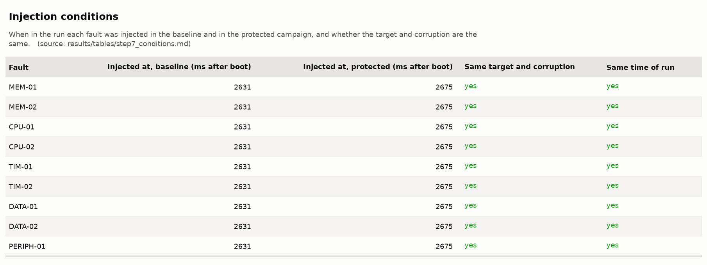

# Results report

Generated by `Tests/tools/make_report.py` from the raw logs; re-run it after any campaign. Sources:

* baseline campaign (Step 4): `results/raw/step4/20261008_135006`
* detection campaign (Step 5): `results/raw/step5/20261008_132103`
* recovery campaign (Step 6): `results/raw/step6/20261008_144835`

Read `docs/SIMULATOR_LIMITATIONS.md` before quoting numbers: the WWDG results are a simulator workaround, Wokwi delivers no fault exceptions, and the simulation is deterministic (repeated runs are bit-identical).

## Acceptance criteria per project step

## What happens after each fault: baseline vs protected firmware

## Detection coverage per fault class

## Detection latency per fault and mechanism

## Recovery time per fault

## Recovery success rate per recovery level

## Resource overhead of the protected firmware

## Control-output error after the injection

## Application progress after the injection

## Recovery attempts and escalation

## Tables as images

The same tables as text (to copy numbers): `tables.md`.
